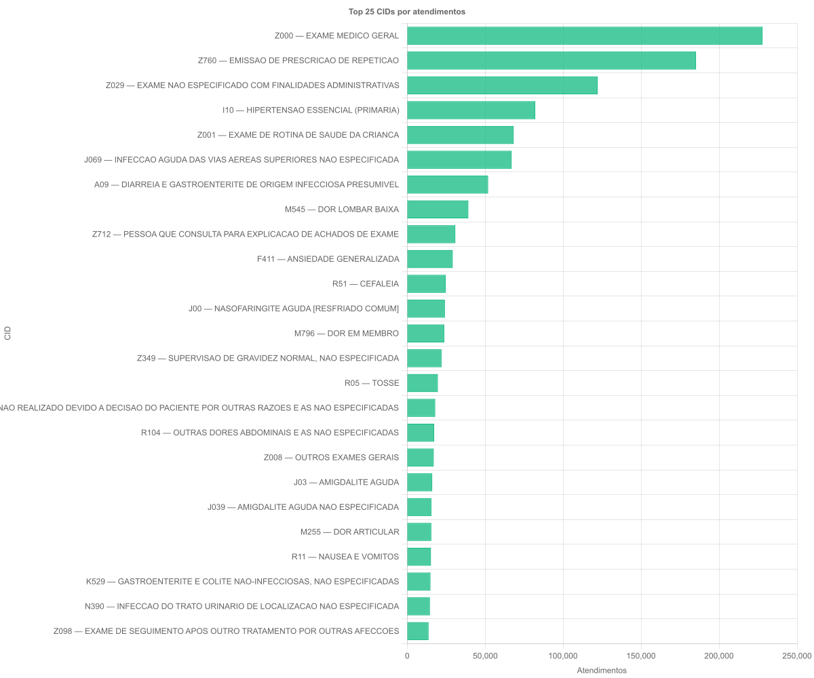

# Descrição dos dados (gráficos gerados)

Esta documentação descreve, de forma semelhante à Seção 3 (“Descrição dos dados”) do artigo fornecido, os gráficos gerados a partir da tabela `public.bd2_sistema_e_saude` do banco `postgiscwb`.

## Base analisada

A base utilizada é a tabela `public.bd2_sistema_e_saude`, composta por registros de atendimentos com atributos clínicos e administrativos (por exemplo: `data_do_atendimento`, `tipo_unidade`, `codigo_unidade`, `bairro`, `municipio`, `codigo_cid` e `descricao_cid`).

Os gráficos desta pasta foram gerados por scripts TypeScript que consultam o PostgreSQL via TypeORM e salvam as imagens em `output/`.

## Gráficos e interpretação

### 1) Volume de atendimentos ao longo do tempo (mensal)

O atributo `data_do_atendimento` é um timestamp e permite analisar a evolução do volume de registros ao longo do tempo. Para facilitar a visualização de tendências e sazonalidade, os dados foram agregados por mês (\(YYYY\text{-}MM\)).

- **Pergunta que o gráfico responde**: Como o volume de atendimentos varia ao longo do tempo (mês a mês)?
- **O que o gráfico mostra**: contagem de atendimentos por mês.
- **Como interpretar**:
  - picos e vales sugerem períodos de maior/menor demanda;
  - mudanças de patamar podem indicar alteração de cobertura, registro ou comportamento do serviço.

Figura 1. Volume de atendimentos ao longo do tempo (mensal).

### 2) Perfil etário dos atendimentos (histograma)

A idade pode ser estimada a partir de `data_de_nascimento` e `data_do_atendimento`. Para isso, a idade foi calculada como a diferença entre as datas (função `age(...)` do PostgreSQL) e convertida para anos. Registros sem `data_de_nascimento` foram desconsiderados nesta visualização, e idades foram limitadas ao intervalo de 0 a 100 anos para reduzir distorções por valores inconsistentes.

- **Pergunta que o gráfico responde**: Qual é o perfil etário (distribuição de idades) dos atendimentos?
- **O que o gráfico mostra**: distribuição de atendimentos por faixas etárias (bins de 5 anos).
- **Como interpretar**:
  - evidencia as faixas etárias com maior concentração de atendimentos;
  - pode indicar perfil de demanda/uso do serviço, e também qualidade de dados (ex.: excesso em extremos pode sugerir datas incorretas).

Figura 2. Histograma de idade no momento do atendimento.

### 3) Top bairros por atendimentos

O atributo `bairro` é textual e pode conter valores vazios ou com variações de preenchimento. Para evitar perda de registros, valores em branco (string vazia) e `NULL` são agrupados na categoria **`(vazio)`**.

- **Pergunta que o gráfico responde**: Quais bairros concentram o maior número de atendimentos?
- **O que o gráfico mostra**: ranking dos bairros com maior número de atendimentos (Top N).
- **Como interpretar**:
  - concentrações elevadas podem refletir densidade populacional, perfil epidemiológico local ou acesso ao serviço;
  - a presença de “(vazio)” no Top N é um indicativo de qualidade de dados (campo não preenchido).

Figura 3. Top bairros por número de atendimentos.

### 4) Top municípios por atendimentos

De forma análoga ao bairro, o atributo `municipio` é textual e pode conter valores ausentes. Os registros `NULL`/vazios também são consolidados em **`(vazio)`**.

- **Pergunta que o gráfico responde**: Quais municípios concentram o maior número de atendimentos?
- **O que o gráfico mostra**: ranking dos municípios com maior número de atendimentos (Top N).
- **Como interpretar**:
  - ajuda a identificar se a base está majoritariamente concentrada em um município (ex.: Curitiba) ou se há maior dispersão regional;
  - novamente, “(vazio)” serve como alerta de preenchimento.

Figura 4. Top municípios por número de atendimentos.

### 5) CID mais frequentes (Top N)

O atributo `codigo_cid` representa a classificação de diagnóstico (CID). Para apoiar uma leitura humana, o gráfico utiliza o rótulo `codigo_cid — descricao_cid` quando `descricao_cid` está disponível.

- **Pergunta que o gráfico responde**: Quais são os diagnósticos (CIDs) mais frequentes na base?
- **O que o gráfico mostra**: os códigos CID mais frequentes e suas contagens.
- **Como interpretar**:
  - evidencia quais diagnósticos (ou motivos de registro) são mais recorrentes na base;
  - pode ser aprofundado por recortes de tempo (mês) ou por local (`bairro`, `tipo_unidade`) para observar mudanças no perfil.

Figura 5. Top CIDs por número de atendimentos.

## Como reproduzir

Os gráficos podem ser regenerados com:

- `npm run chart:volume`
- `npm run chart:idade`
- `npm run chart:top-locais`
- `npm run chart:top-cid`

Por padrão, `chart:top-locais` e `chart:top-cid` aceitam `TOP_N` via variável de ambiente:

- exemplo: `TOP_N=30 npm run chart:top-cid`

