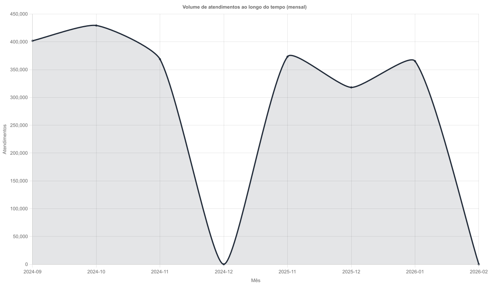
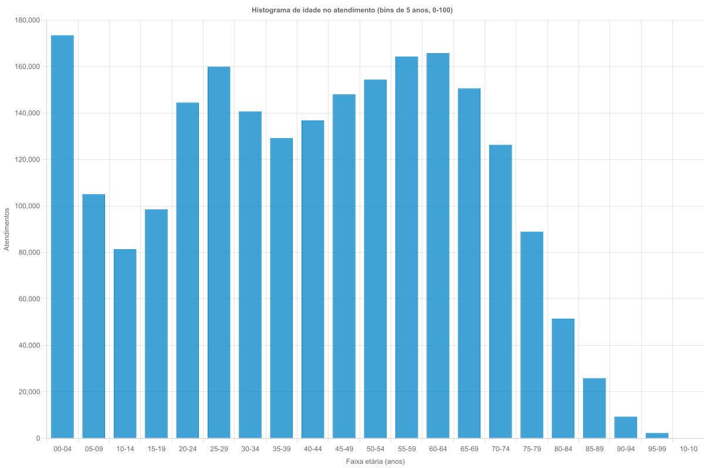
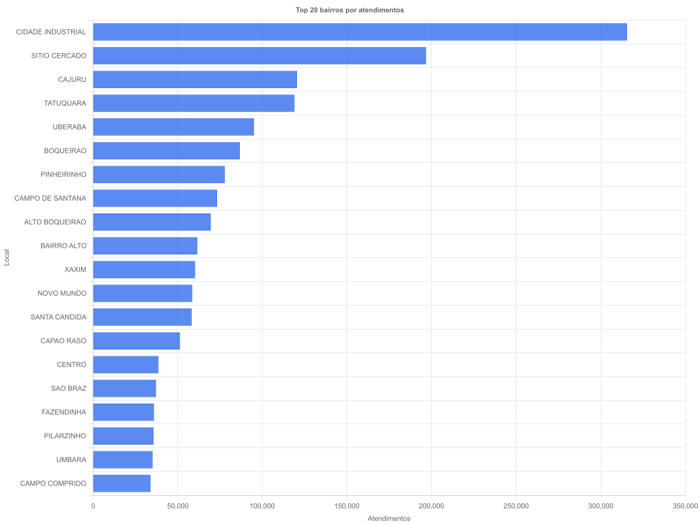
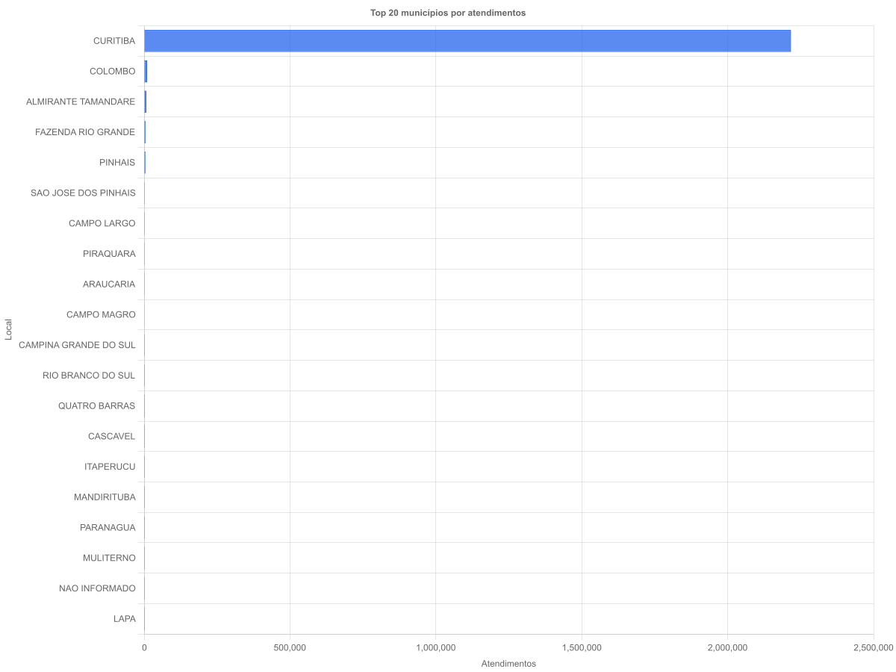
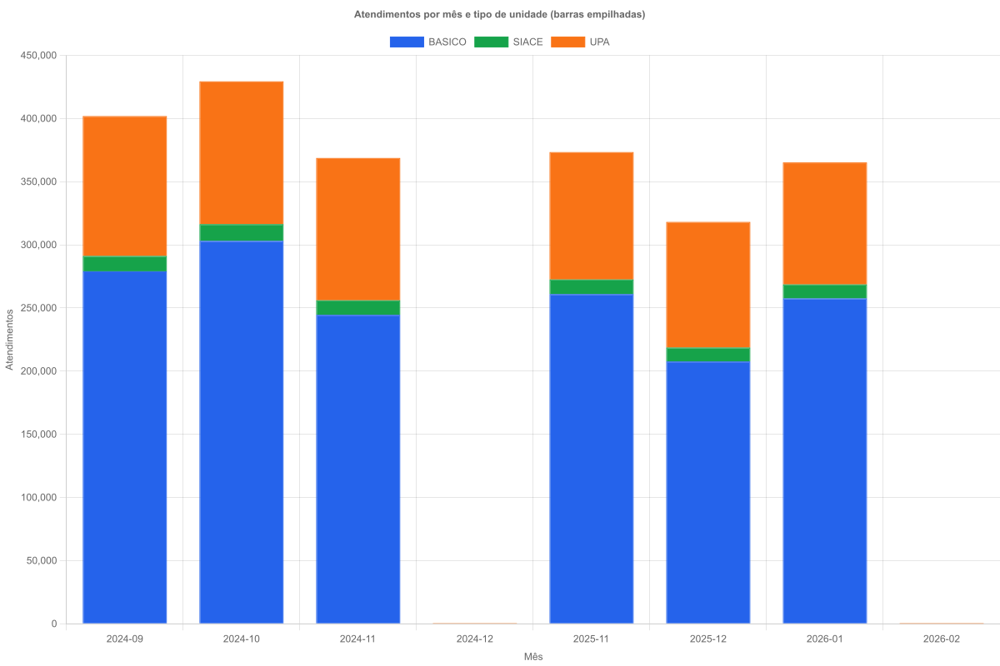

# Análise exploratória da tabela `bd2_sistema_e_saude` em PostgreSQL

**Aluno**: _<preencher>_  
**Disciplina**: Banco de Dados — Tarefa 3  
**Instituição**: UTFPR  
**E-mail**: _<preencher>_

**Abstract.** This report presents an initial exploratory analysis of the table `public.bd2_sistema_e_saude` stored in PostgreSQL, describing its attributes, record count, modeling decisions (primary key), and a set of basic and advanced questions supported by tables and charts.

**Resumo.** Este relatório apresenta uma análise exploratória inicial da tabela `public.bd2_sistema_e_saude` em PostgreSQL, descrevendo atributos, quantidade de tuplas, decisões de modelagem (chave primária) e um conjunto de perguntas básicas e avançadas apoiadas por tabelas e gráficos.

## 1. Introdução

O objetivo deste documento é apresentar a tabela utilizada no trabalho, descrever seus atributos e propor perguntas que caracterizem o conjunto de dados. O formato segue a organização sugerida pelo template da SBC (título, resumo/abstract, seções, tabelas e figuras).

## 2. Base de dados e tabela

- **Banco**: `postgiscwb` (conexão via `DATABASE_URL`)
- **Tabela**: `public.bd2_sistema_e_saude`
- **Quantidade de tuplas**: **2.256.598** registros

## 3. Descrição dos dados (estilo Seção 3 do artigo-exemplo)

Cada tupla representa um atendimento, contendo atributos de tempo (`data_do_atendimento`), unidade de atendimento (`tipo_unidade`, `codigo_unidade`, `descricao_unidade`), localização (`bairro`, `municipio`) e informações clínicas (por exemplo `codigo_cid`, `descricao_cid`), além de campos auxiliares (solicitação de exames, encaminhamento, farmácia etc.).

### 3.1. Exemplo de tupla (amostra)

Tabela 1. Exemplo de tupla (com `cod_usuario` parcialmente mascarado).

| Campo | Valor |
|---|---|
| `data_do_atendimento` | 2024-10-04 10:33:39 |
| `data_de_nascimento` | 1994-06-27 03:00:00 |
| `sexo` | M |
| `tipo_unidade` | BASICO |
| `codigo_unidade` | 5406617 |
| `descricao_unidade` | UMS VILA SANDRA PSF |
| `codigo_cid` | Z760 |
| `descricao_cid` | EMISSAO DE PRESCRICAO DE REPETICAO |
| `bairro` | CAMPO COMPRIDO |
| `municipio` | CURITIBA |
| `solicitacao_exames` | Sim |
| `encaminhamento_especialista` | Nao |
| `desencadeou_internamento` | Nao |
| `cod_usuario` | 12*** |

### 3.2. Descrição dos atributos (resumo)

A Tabela 2 resume os atributos mais relevantes e seus tipos (com tamanhos `varchar(n)` quando aplicável).

Tabela 2. Atributos selecionados da tabela `bd2_sistema_e_saude`.

| Atributo | Tipo | Descrição |
|---|---:|---|
| `data_do_atendimento` | `timestamp` | Data/hora do atendimento. |
| `data_de_nascimento` | `timestamp` | Data de nascimento. |
| `sexo` | `varchar(1)` | Sexo (ex.: `M`, `F`). |
| `tipo_unidade` | `varchar(50)` | Tipo de unidade (ex.: BASICO/UPA). |
| `codigo_unidade` | `varchar(150)` | Código da unidade. |
| `bairro` | `varchar(72)` | Bairro. |
| `municipio` | `varchar(50)` | Município. |
| `codigo_cid` | `varchar(4)` | CID. |
| `descricao_cid` | `varchar(150)` | Descrição do CID. |

> Observação: a implementação completa da Entity (incluindo `length` e índices) está em `src/entities/Bd2SistemaESaude.ts`.

## 4. Problemas encontrados na inserção/modelagem

### 4.1. Definição de chave primária

Foi observado que **nenhum atributo isolado** era suficiente como identificador único (existiam duplicidades naturais). Por isso, foi necessário testar chaves conjuntas até obter unicidade. A chave primária definida foi:

- **PK composta**: (`data_do_atendimento`, `codigo_unidade`, `codigo_cid`, `cod_usuario`)

### 4.2. Conformidade do schema com o TypeORM

Durante a geração de migrations, diferenças entre o schema real e o schema inferido pela Entity (por exemplo, `varchar` sem `length` e ausência de `@Index`) faziam o TypeORM sugerir alterações agressivas. A Entity foi ajustada para **bater 100% com o banco** (tamanhos `varchar(n)` e índices declarados).

## 5. Perguntas e resultados (tabelas/gráficos)

Nesta seção são propostas **5 perguntas básicas** e **2 avançadas**, indicando a melhor forma de apresentar o resultado (gráfico/tabela). Os gráficos gerados estão na pasta `output/`.

### 5.1. Perguntas básicas (com visualização)

**P1. Como o volume de atendimentos varia ao longo do tempo (mês a mês)?**  
- **Melhor forma**: gráfico de linha (série temporal mensal).  
- **Figura**: Figura 1 em `output/volume-atendimentos-mensal.png`.

Figura 1. Volume de atendimentos ao longo do tempo (mensal).

**P2. Qual é o perfil etário (distribuição de idades) dos atendimentos?**  
- **Melhor forma**: histograma (bins de 5 anos).  
- **Figura**: Figura 2 em `output/idade-histograma.png`.

Figura 2. Histograma de idade no momento do atendimento.

**P3. Quais bairros concentram o maior número de atendimentos?**  
- **Melhor forma**: barras horizontais (Top N).  
- **Figura**: Figura 3 em `output/top-bairros.png`.

Figura 3. Top bairros por número de atendimentos.

**P4. Quais municípios concentram o maior número de atendimentos?**  
- **Melhor forma**: barras horizontais (Top N).  
- **Figura**: Figura 4 em `output/top-municipios.png`.

Figura 4. Top municípios por número de atendimentos.

**P5. Qual é a distribuição de atendimentos por `tipo_unidade` ao longo do tempo?**  
- **Melhor forma**: barras empilhadas por mês (Top tipos + OUTROS).  
- **Figura**: Figura 5 em `output/tipo-unidade-por-mes.png`.

Figura 5. Atendimentos por mês e tipo de unidade (barras empilhadas).

> Complemento: o ranking de CIDs mais frequentes também foi gerado em `output/top-cid.png` e pode ser usado como análise adicional.

### 5.2. Perguntas avançadas (fatores ambientais)

**A1. Dias mais chuvosos estão associados a mudanças no volume e no perfil dos atendimentos?**  
- **Variável ambiental**: precipitação diária (mm) para Curitiba (INMET/Simepar).  
- **Melhor forma**: dispersão (chuva × volume diário), boxplot por faixas de chuva e análise de defasagem (lags de 1–7 dias).  
- **Dados necessários**: tabela `clima_diario(data_dia, precipitacao_mm, ...)` e join por `date(data_do_atendimento)`.

**A2. O nível de ruído urbano está associado a maior frequência de certos diagnósticos (ex.: `R51`) ou à procura por determinados tipos de unidade?**  
- **Variável ambiental**: ruído por bairro/região (ex.: \(L_{eq}\) diário/mensal).  
- **Melhor forma**: dispersão por bairro (ruído × taxa de um CID) e heatmap bairro × mês.  
- **Dados necessários**: tabela `ruido_bairro_mes(bairro_padronizado, mes, leq, ...)` e join por `bairro` + mês.

## 6. Como reproduzir os gráficos

Os gráficos podem ser regenerados com:

- `npm run chart:volume`
- `npm run chart:idade`
- `npm run chart:top-locais`
- `npm run chart:top-cid`
- `npm run chart:tipo-unidade`

## Referências

- Artigo-exemplo (Seção 3): `17239-373-13830-1-10-20210917.pdf`
- Template SBC: `sbc_template.pdf`

